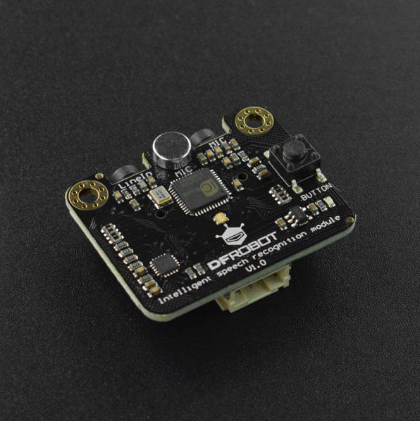

# DFRobot_ASR
- [中文版](./README_CN.md)

让声音为您的项目增添一抹特色！连接上语音识别模块，再添加几行简单的码，您的项目就可以听懂您说的话。无
需机器学习，无需特定人语音，无需联网，随时随地都可以进行语音识别，结合语音合成模块还可以实现语音对话。
  使用Gravity 
I2C接口通信，兼容绝大部分主控，非常适合接入教育场景使用。三种语音识别模式和三种语音输入方式使模块可以集
  成入更多的场景。




## 产品链接（https://www.dfrobot.com.cn/goods-3011.html）

    DFR0715：Gravity: I2C语音识别模块

## 目录

  * [概述](#概述)
  * [库安装](#库安装)
  * [方法](#方法)
  * [兼容性](#兼容性)
  * [历史](#历史)
  * [创作者](#创作者)
## 概述

  1.向语音识别模块添加词条,每一个词条会附带一个编号<br>
  2.当模块识别到添加的词条时,会返回对应的编号<br>


## 库安装

To use this library, please download the library file first, and paste it into the \Arduino\libraries directory, then open the examples folder and run the demo in the folder.

```
$> python speech_recognition.py
```

## 方法

```python
  def begin(self ,mode,miMode):
  '''
    @fn begin
    @brief 初始化函数
    @param mode 语音识别模式
    @param miMode 麦克风模式
    @return 返回0表示初始化成功，返回其他值表示初始化失败，返回错误码
  '''

  def start(self):
  '''
    @fn start
    @brief 语音模块开始识别.
  '''

  def addCommand(self,words,idNum):
  '''
    @fn addCommand
    @brief 向模块添加词条
    @param words 代表词条的字符串
    @param idNum 词条的识别号
    @return Boolean type, the result of seted
    @retval 添加词条成功
    @retval 添加词条失败
  '''
    
  def read(self):
  '''
    @fn read
    @brief 读取识别到的词条.
    @return 返回代表词条的识别号
  '''

  def setI2CAddr(self ,addr):
  '''
    @fn setI2CAddr
    @brief 设置模块的i2c地址(从新上电后生效)
    @param addr 需要设置的i2c地址(0~127)
  '''

```

## 兼容性

| 主板         | 通过 | 未通过 | 未测试 | 备注 |
| ------------ | :--: | :----: | :----: | :--: |
| RaspberryPi2 |      |        |   √    |      |
| RaspberryPi3 |      |        |   √    |      |
| RaspberryPi4 |  √   |        |        |      |

* Python 版本

| Python  | 通过 | 未通过 | 未测试 | 备注 |
| ------- | :--: | :----: | :----: | ---- |
| Python2 |  √   |        |        |      |
| Python3 |  √   |        |        |      |
## 历史

September 9, 2020 - Version 1.0 released.

## 创作者

Written by fengli(li.feng@dfrobot.com), 2019.8.25 (Welcome to our [website](https://www.dfrobot.com/))